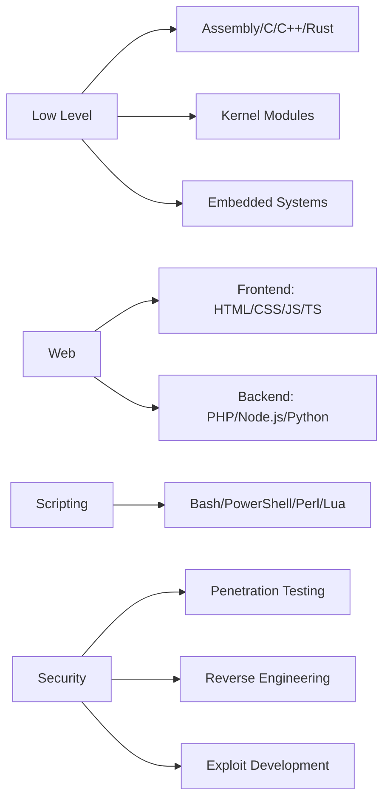

# 💀 Lutfifakee

<p align="center">
  
  <br>
  
</p>

---

## Whoami

```bash
> sudo whoami
Lutfifakee@root:~$ 
```

```nim
let identity = "Lutfifakee"
echo "Hello, world! I'm ", identity, " - a digital ghost roaming the halls of cyberspace."
```

Hello, world! I'm **Lutfifakee** — a digital ghost roaming the halls of cyberspace. By day, I'm a developer crafting code with precision and elegance; by night, I transform into a penetration tester hunting for vulnerabilities in systems.

My mission? Making the digital world a safer place, **one vulnerability at a time**. Since 2018, I've been immersed in the world of cybersecurity — navigating firewalls, understanding protocol languages, and ethically uncovering system weaknesses.

For me, security isn't just about finding vulnerabilities, but about understanding how systems work at the **lowest level**, how they can fail, and how to make them stronger than ever.

---

## Language Matrix

### Hardware-Near Languages (Speaking directly to the silicon)
```
Assembly    ■■■■■■■■■■ 100% - Talking to CPUs in their native tongue
C           ■■■■■■■■■■ 100% - The godfather of system programming
C++         ■■■■■■■■■□ 95%  - When objects meet performance
Rust        ■■■■■■■■■□ 95%  - Memory-safe without garbage collection
Zig         ■■■■■■■□□□ 75%  - Modern take on system programming
```

### Web Development (Crafting digital experiences)

**Frontend:**
```
HTML        ■■■■■■■■■■ 100% - The skeleton of the web
CSS         ■■■■■■■■■■ 100% - Making things beautiful
JavaScript  ■■■■■■■■■■ 100% - The language that runs the world
TypeScript  ■■■■■■■■■□ 95%  - JavaScript with superpowers
Dart        ■■■■■■■□□□ 75%  - Flutter's native tongue
```

**Backend:**
```
PHP         ■■■■■■■■■■ 100% - Powering 80% of the web
Node.js     ■■■■■■■■■■ 100% - JavaScript on the server
Python      ■■■■■■■■■■ 100% - The Swiss Army knife
Java        ■■■■■■■■■□ 95%  - Enterprise-grade robustness
Go          ■■■■■■■■■□ 95%  - Concurrency done right
Ruby        ■■■■■■■□□□ 80%  - Developer happiness first
C#          ■■■■■■■□□□ 80%  - Microsoft's finest
Kotlin      ■■■■■■□□□□ 70%  - Java but better
Swift       ■■■■■■□□□□ 70%  - Apple's ecosystem
```

### Most Frequently Used (My daily drivers)
```
Bash        ■■■■■■■■■■ 100% - Automating everything
PowerShell  ■■■■■■■■■□ 95%  - When Windows needs some love
Perl        ■■■■■■■■■■ 100% - The duct tape of the internet
Lua         ■■■■■■■■■■ 100% - Embedding scripts everywhere
```

---

## Tech Stack Visualization

<p align="center">
  
</p>

---

## Architecture Expertise



---

## Arsenal

### Core Weapons
| Category | Tools & Technologies |
|----------|---------------------|
| Primary Languages | Python, JavaScript/TypeScript, PHP, C/C++, Assembly |
| Web Stack | HTML5, CSS3, React.js, Node.js, Express.js, Laravel |
| Pentesting | Metasploit, Burp Suite Pro, Nmap, Wireshark, SQLmap, Ghidra |
| Security | Firewall Configuration, IDS/IPS, Cryptography, Reverse Engineering |
| Databases | MySQL, MongoDB, PostgreSQL, Redis, SQLite |
| DevOps & Tools | Docker, Kubernetes, Jenkins, Git, Vagrant, Ansible |
| Scripting | Bash, PowerShell, Perl, Lua, AWK, Sed |

---

## Certifications & Achievements

```
┌─────────────────────────────────────┐
│  OSCP  ■■■■■■■■■■  Certified        │
│  CEH   ■■■■■■■■■■  Certified        │
│  HTB   ■■■■■■■■■■  Top 5% Global    │
│  CVE   ■■■■■■■■■■  Multiple Finds   │
└─────────────────────────────────────┘
```

- OSCP (Offensive Security Certified Professional)
- CEH (Certified Ethical Hacker)
- Top 5% in HackTheBox Global Rankings
- Multiple CVEs Discovered & Credited
- Bug Bounty Hall of Fame Member

---

## GitHub Stats

<p align="center">
  
  
</p>

<p align="center">
  
</p>

<p align="center">
  
</p>

---

## Current Operations

```
[ACTIVE] Working on: Advanced penetration testing automation tools
[LEARNING] Blockchain security & Smart Contract auditing
[OPEN] Looking to collaborate: Open-source security tools
[EXPERT] Ask me about: Ethical hacking, Network security, Exploit development
[FUN] Fact: I can crack a Wi-Fi password faster than you can say "cybersecurity"
```

---

## Connect With Me

<p align="center">
  <a href="https://linkedin.com/in/lutfifakee" target="_blank">
    
  </a>
  <a href="https://twitter.com/lutfifakee" target="_blank">
    
  </a>
  <a href="https://github.com/Lutfifakee" target="_blank">
    
  </a>
  <a href="mailto:lutfifakee@protonmail.com">
    
  </a>
  <a href="https://hackthebox.com/profile/lutfifakee">
    
  </a>
  <a href="https://tryhackme.com/p/lutfifakee">
    
  </a>
</p>

---

## Featured Projects

| Project | Description | Stars | Tech Stack |
|---------|-------------|-------|------------|
| [VulnScanner](https://github.com/Lutfifakee/vulnscanner) | Automated vulnerability scanner with ML | ⭐ 245 | Python, Nmap, TensorFlow |
| [WebCrawlerX](https://github.com/Lutfifakee/webcrawlerx) | Advanced web crawling & enumeration | ⭐ 189 | Python, Selenium, BeautifulSoup |
| [NetMonitor](https://github.com/Lutfifakee/netmonitor) | Real-time network monitoring & IDS | ⭐ 156 | C++, Wireshark, TCPDump |
| [SQLMapPro](https://github.com/Lutfifakee/sqlmappro) | Automated SQL injection tool | ⭐ 312 | Python, PHP, MySQL |
| [HashCracker](https://github.com/Lutfifakee/hashcracker) | Multi-algorithm hash cracker | ⭐ 98 | C, OpenCL, Assembly |

---

## Weekly Development Breakdown

<!--START_SECTION:waka-->
```text
Python       8 hrs 30 mins  ████████░░░░░░░░░░░░░░   38.2%
C/C++        4 hrs 45 mins  ████▒░░░░░░░░░░░░░░░░░   21.5%
PHP          3 hrs 20 mins  ███░░░░░░░░░░░░░░░░░░░   15.1%
JavaScript   2 hrs 15 mins  ██░░░░░░░░░░░░░░░░░░░░   10.3%
Bash         1 hr 45 mins   █▒░░░░░░░░░░░░░░░░░░░░    8.0%
Assembly     1 hr           █░░░░░░░░░░░░░░░░░░░░░    4.6%
Other        30 mins         ▒░░░░░░░░░░░░░░░░░░░░░    2.3%
```
<!--END_SECTION:waka-->

---

## When I'm Not Coding

```
Playing CTF competitions on HackTheBox & TryHackMe
Reading cybersecurity research papers & exploit databases
Listening to synthwave/LoFi while hacking
Drinking coffee (lots of it!) - Fuel for late-night sessions
Reverse engineering old video games for fun
Building custom mechanical keyboards
```

---

## Currently Vibing To

<p align="center">
  <a href="https://spotify-github-profile.vercel.app/api/view?uid=your_spotify_id&redirect=true">
    
  </a>
</p>

---

## Terminal Fun

```bash
# Check out my activity
$ curl -s https://api.github.com/users/Lutfifakee/events | jq '.[].type'

# Hire me (maybe?)
$ echo "lutfifakee@protonmail.com" | base64 -d
```

---

<p align="center">
  
</p>

<p align="center">
  
  <br>
  <i>"The only secure system is the one that's powered off. And even that's questionable."</i>
  <br>
  
</p>

<p align="center">
  
</p>

<p align="center">
  
</p>
